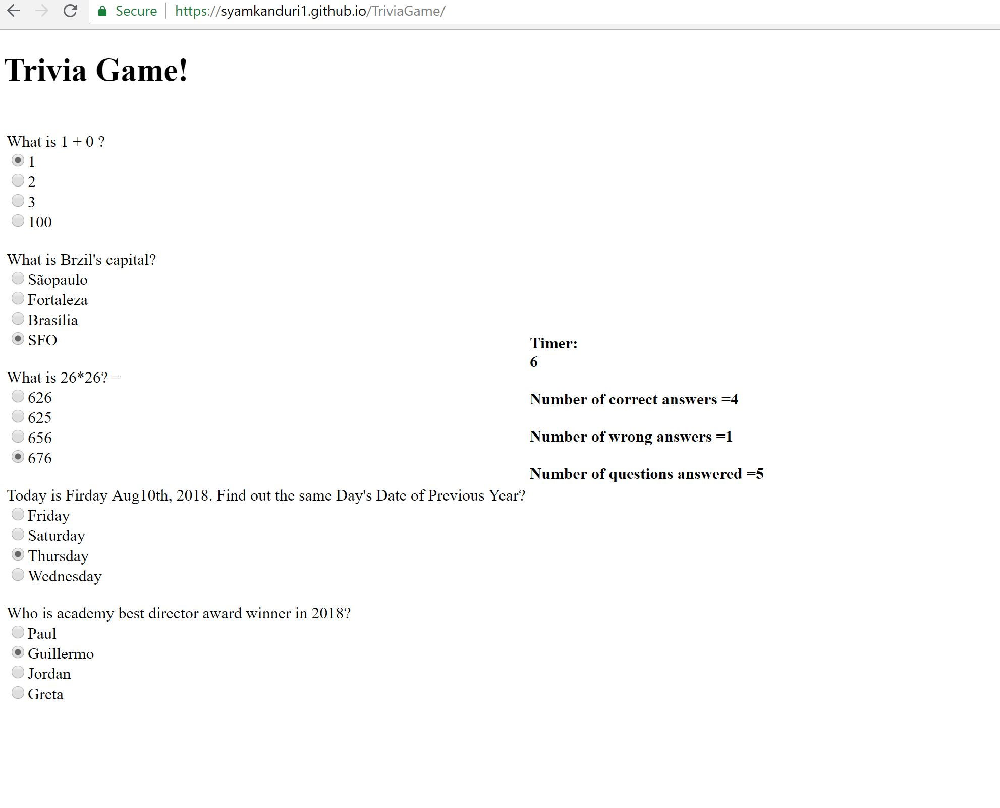

# Trivia Game

<!-- Put the name of the project after the # -->
<!-- the # means h1  -->
# Homework # 5 - Trivia Game

<!-- Put a description of what the project is -->
To develop a small game using javascript, jQuery, css and html. 

# Link to deployed site
<!-- make a link to the deployed site --> 
<!-- [What the user will see](the link to the deployed site) -->
[my fifth homework](https://syamkanduri1.github.io/TriviaGame/)


# Images
<!-- take a picture of the image and add it into the readme  -->
<!--  -->



# technology used
<!-- make a list of technology used -->
<!-- what you used for this web app, like html css -->

html, jQuery, javascript
<!-- 
1. First ordered list item
2. Another item
⋅⋅* Unordered sub-list. 
1. Actual numbers don't matter, just that it's a number
⋅⋅1. Ordered sub-list
4. And another item. 
-->


# code snippets
<!-- put snippets of code inside ``` ``` so it will look like code -->
<!-- if you want to put blockquotes use a > -->

```
        If game started, then populate questions..
        if(!gameStarted){
            for (var i=0; i < questions.length; i++){
            htmlString += "<br>" + questions[i].question +"<br>";
            for (j=0;j<questions[i].answers.length; j++){
                htmlString += "<input type=radio id=answer-"+i+j + " name=answer-"+i+"><label>"+ questions[i].answers[j] +"</label><br>";
            }
        } 
        $("#play-area").append(htmlString);
        $("#start").hide();
        gameStarted = true;
        run();        

        once user selections are made, gather inputs, compare with correct answers, populate counts and render results on the screen..

        function stopAndShowResults() {
        clearInterval(intervalId);
        var radioBtnSelected;
        var numAnswered = 0;
        var numCorrectAnswers=0;
        var numWrongAnswers=0;
        for (var i=0; i < questions.length; i++){
        for (j=0;j<questions[i].answers.length; j++){
                radioBtnSelected = "answer-"+i+j;
                radioBtnSelected = "input[id="+radioBtnSelected+"]:checked";
                selectedVal = $(radioBtnSelected).val();
                if(selectedVal === 'on'){
                    numAnswered++;
                    if (questions[i].answers[j] === questions[i].correctAnswer){
                        numCorrectAnswers++;
                    }else if(questions[i].answers[j] != questions[i].correctAnswer){
                        numWrongAnswers++;
                    }
                }
            }   
        } 
        $("#numCorrectAnswers").html("<br><b> Number of correct answers =" + numCorrectAnswers + "</b>");
        $("#numWrongAnswers").html("<br><b> Number of wrong answers =" + numWrongAnswers + "</b>");
        $("#numAnswered").html("<br><b>Number of questions answered =" + numAnswered + "</b><br>");
        $("#done").hide();        
```


# Learning points
<!-- Learning points where you would write what you thought was helpful -->
Working with radio button is definitely learning and I am certain there is much cleaner way to get this done

# Author 
Syam Kanduri

# License
Standard MIT License